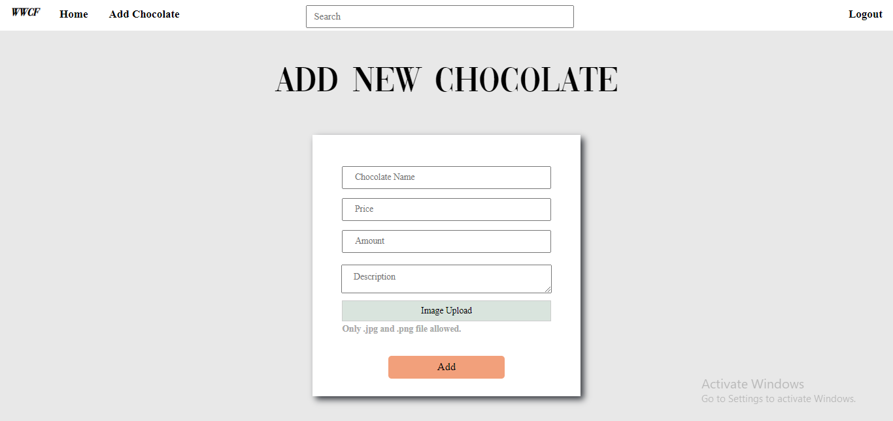
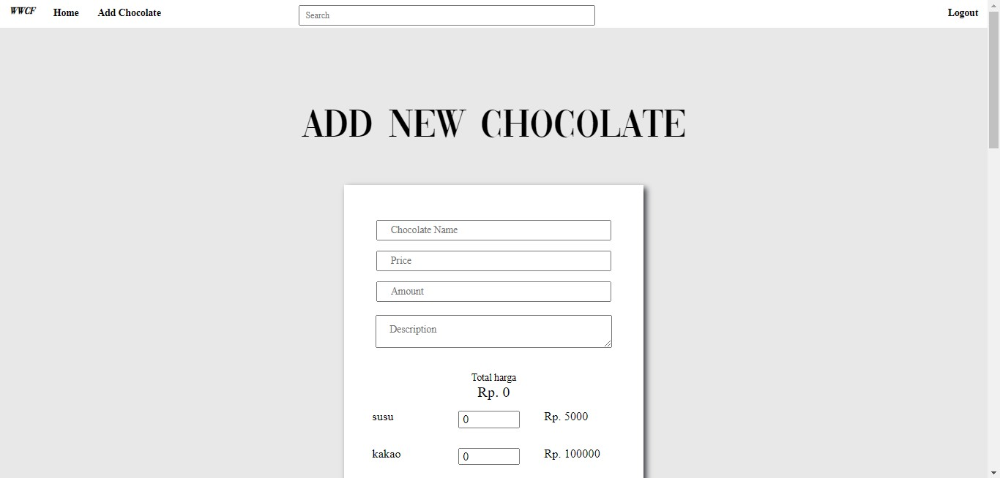

#  Willy Wangky's Web

## Deskripsi

Willy Wangky's Web merupakan sebuah aplikasi website dimana user dapat membeli cokelat tanpa harus memperdulikan saldo yang dimiliki, user dapat melihat sejumlah coklat yang tersedia di web dan membelinya. Selain itu, web tersebut juga memiliki admin dimana admin memiliki hak untuk menambah stok cokelat yang ada dan juga menambah produk coklat yang ada beserta resepnya.

## Basis Data 
Tidak ada perubahan pada basis data yang lama.
Basis data terdiri dari :
- product : id, name, amountSold, price, amountRemaining, description, path
- transaction : transactionID,productID, username, amount, total, timestamp, address
- user : username, email, password, superuser, cookie

## Screenshot Perubahan Tampilan
### BEFORE

### AFTER


## Instalasi
### APACHE
#### Windows
1. Download XAMPP from https://www.apachefriends.org/download.html
2. Run the installer that has been downloaded
3. Follow the instalation step
4. Open XAMPP to check if it work
5. Click start tombols in Apache's row to use APACHE


#### Ubuntu 18.04
- Install APACHE
```
sudo apt update
sudo apt install apache2
```
- Adjusting the Firewall
```
sudo ufw app list
sudo ufw allow 'Apache'
```
- Checking your web server
```
sudo systemctl status apache2
```

### MY SQL
#### Windows
1. Download MySQL Installer from https://dev.mysql.com/downloads/installer/ and execute it.
2. Determine the setup type to use for the initial installation of MySQL products.
3. Install the server instance (and products) and then begin the server configuration by first selecting one of the following levels of availability for the server instance:
    - Standalone MySQL Server / Classic MySQL Replication (default), configures a server instance to run without high availability.
    - InnoDB cluster, provides two configuration options based on MySQL Group Replication to:
        - Configure multiple server instances in a sandbox InnoDB Cluster on the local host (for testing only).
        - Create a new InnoDB Cluster and configure one seed instance or add a new server instance to an        existing InnoDB Cluster.
4. Complete the configuration process by following the onscreen instructions. 

#### Ubuntu 18.04
1. Installing MySQL
```
sudo apt update
sudo apt install mysql-server
```
2. Configure MySQL
```
sudo mysql_secure_installation
```
3. Adjusting User Authentication and Privileges (optional)
For this case, our database is using database with user ___ and password ___ with database name is ___:
- Open MySQL
```
sudo mysql
```
- Next, check which authentication method each of your MySQL user accounts use with the following command:
```
SELECT user,authentication_string,plugin,host FROM mysql.user;
```
```
output
+------------------+-------------------------------------------+-----------------------+-----------+
| user             | authentication_string                     | plugin                | host      |
+------------------+-------------------------------------------+-----------------------+-----------+
| root             |                                           | auth_socket           | localhost |
| mysql.session    | *THISISNOTAVALIDPASSWORDTHATCANBEUSEDHERE | mysql_native_password | localhost |
| mysql.sys        | *THISISNOTAVALIDPASSWORDTHATCANBEUSEDHERE | mysql_native_password | localhost |
| debian-sys-maint | *CC744277A401A7D25BE1CA89AFF17BF607F876FF | mysql_native_password | localhost |
+------------------+-------------------------------------------+-----------------------+-----------+
4 rows in set (0.00 sec)
```
- Configure root account
```
ALTER USER 'root'@'localhost' IDENTIFIED WITH mysql_native_password BY 'password';
FLUSH PRIVILEGES;
```
- Create user
```
CREATE USER 'sammy'@'localhost' IDENTIFIED BY 'password';
GRANT ALL PRIVILEGES ON *.* TO 'sammy'@'localhost' WITH GRANT OPTION;
```
### PHP
#### Windows
1. Download XAMPP from https://www.apachefriends.org/download.html
2. Run the installer that has been downloaded
3. Follow the instalation step
4. To run php open terminal and type 
```
php -S localhost:xxxx
```
with 'xxxx' as port

#### Ubuntu 18.04
1. Add PHP PPA Repository
```
sudo apt-get update
sudo apt -y install software-properties-common
sudo add-apt-repository ppa:ondrej/php
sudo apt-get update
```
2. Install PHP 7.4 on Ubuntu 18.04
```
sudo apt -y install php7.4
```
3. Use the next command to install additional packages:

```
sudo apt-get install php7.4-xxx

```
4. Use this command to install php-mysql (a package that we use for this project)
```
sudo apt-get install php-mysql
```
5. Restart Apache
```
sudo service apache2 restart
```

## Menjalankan server
1. Buka root folder di project ini
2. Jalankan command berikut di terminal
```
php -S 127.0.0.1:8000
```
3. Sudah terjalan!


## Pembagian Tugas

Setiap anggota kelompok diwajibkan untuk mengerjakan bagian frontend dan backend.

### REST
1. Supplier Fungsi 1 : 13518101, 13518149
2. Supplier Fungsi 2 : 13518101, 13518142


### SOAP
1. Factory Fungsi 1 : 13518101
2. Factory Fungsi 2  : 13518149
3. Factory Fungsi 3 : 13518149
4. Factory Fungsi 4 : 13518101, 13518142
5. Factory Fungsi 5 : 13518101, 13518142, 13518149
6. Factory Fungsi 6 : 13518101
7. Factory Fungsi 7 : 13518101
8. Factory Fungsi 8 : 13518101
9. Login-logout : 13518101

### REACTJS
1. Login-logout : 13518101
2. Order page : 13518101, 13518142
3. Ingredients page : 13518101
4. Shop page + mekanisme pembelian + saldo : 13518101
5. Chocolate page : 13518149
6. Recipe page : 13518142


### PERUBAHAN WILLY WANGKY'S WEB
1. Mengirimkan request penambahan stok coklat kepada web service Factory : 13518101
2. Secara berkala, aplikasi mengecek status request ke web service Factory selama masih terdapat request dengan status Pending : 13518149
3. Menambahkan stok coklat yang baru ke dalam basis data : 13518149
4. Menampilkan halaman pembuatan jenis coklat baru, dimana list material yang mungkin didapat dari web service Supplier : 13518101
5. Mengirimkan request ke web service Factory berupa resep dari jenis coklat yang baru beserta harganya : 13518101, 13518142

Asisten IF3110 - 2020

Abel | Agwar | Asif | Iwang | Meyer | Vendra