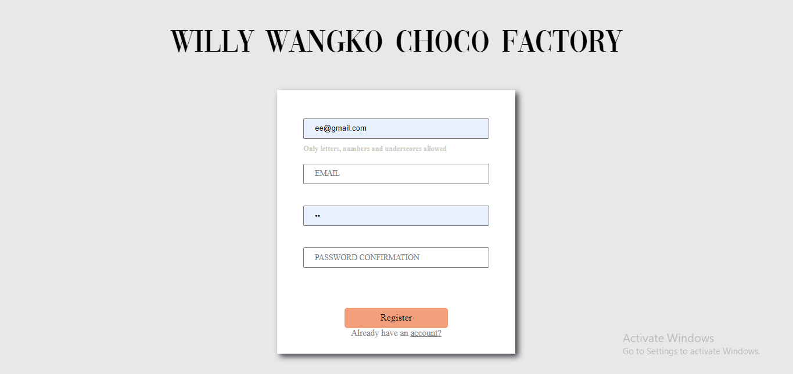
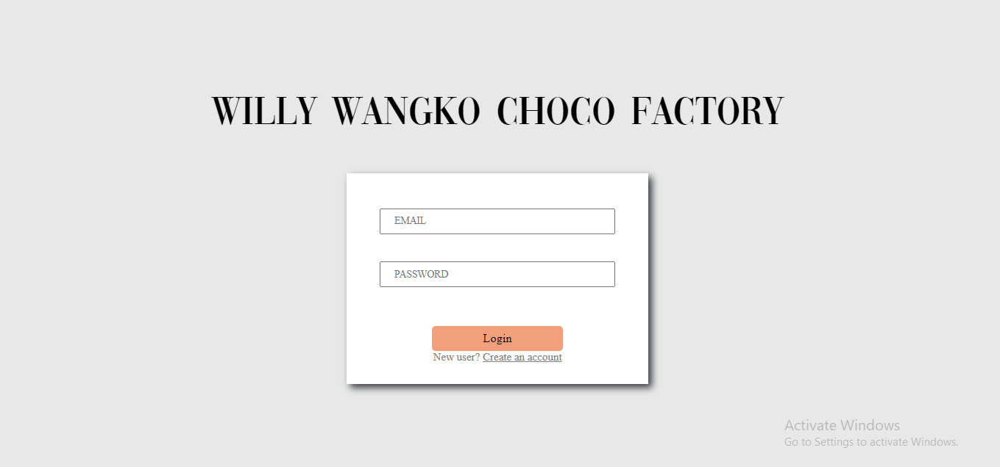
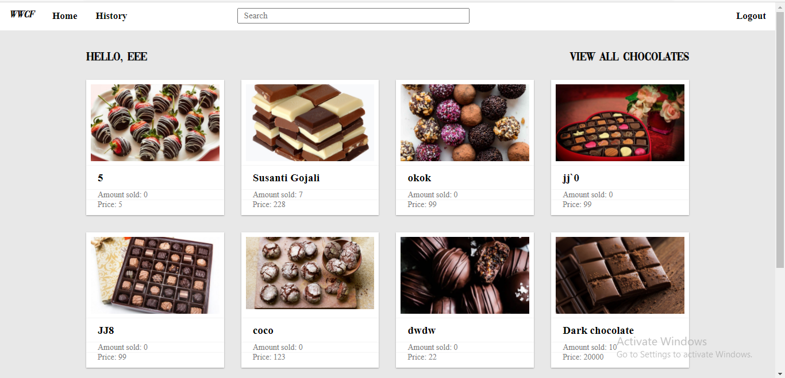
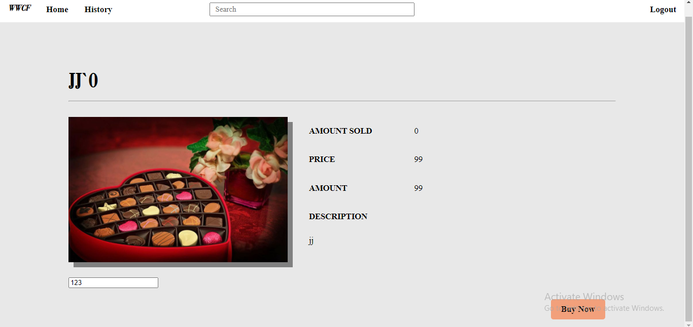
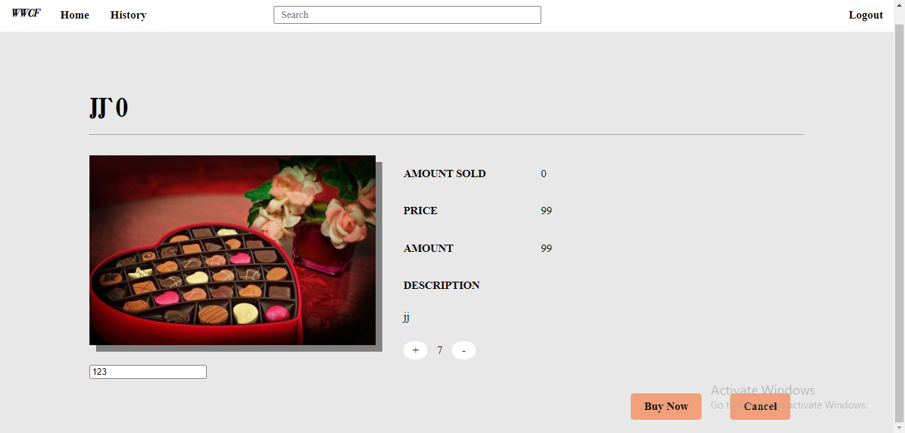
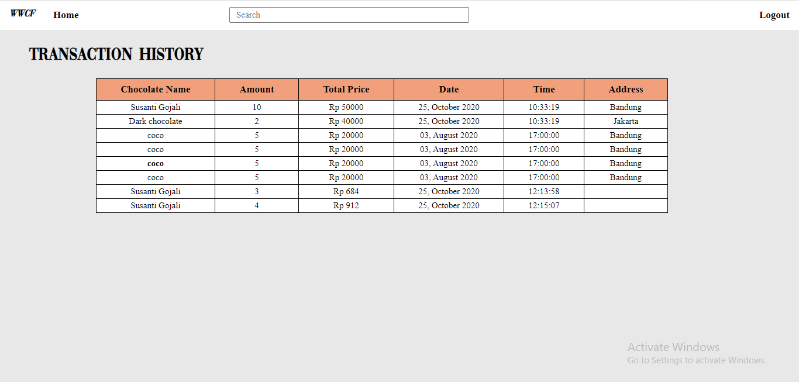
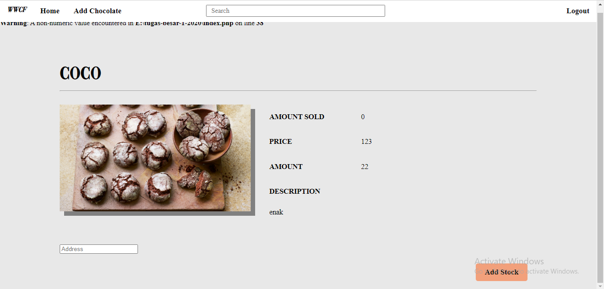
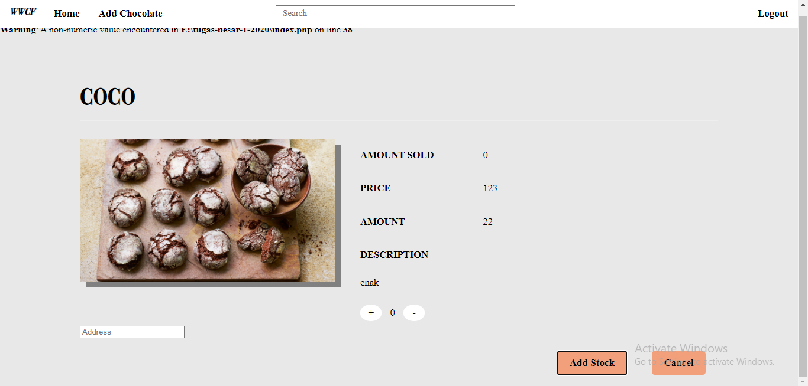

# Tugas 1 IF3110 Pengembangan Aplikasi Berbasis Web

## Tujuan Pembelajaran Tugas Besar 1

* Mahasiswa mampu membuat sebuah aplikasi web dengan menggunakan HTML, CSS dan JS.
* Mahasiswa mampu  membuat sebuah layanan web dengan menggunakan PHP.
* Mahasiswa mampu menggunakan AJAX 
* Mahasiswa  memahami penangananan state dan perbedaan HTTP method.

## Deskripsi Singkat

<div align="center">

</div>


Anda mungkin sudah tahu mengenai pabrik coklat terbesar seantero dunia, Willy Wangky.
Akan tetapi, produsen terbaik tidak akan sukses tanpa konsumen dan distributor terbaik.
Sebab coklat dari Willy Wangky sangat disenangi konsumen, maka Willy Wangky membutuhkan distributor yang handal dalam menangani penjualan coklat.
Untungnya, Willy Wangky mengenal Jan.
Jan sudah sangat pengalaman dengan distribusi makanan dan minuman ringan.
Bahkan, Jan sudah memiliki usaha sendiri bernama Jan’s Cook.

Willy Wangky pun meminta Jan untuk memberikan saran bagaimana cara menjual coklat-coklat miliknya pada konsumen.
Apalagi di tengah pandemi seperti ini, beberapa toko penjualan sepi dikunjungi pengunjung.
Jan tanpa pikir panjang, memberikan saran mengenai penjualan daring menggunakan aplikasi berbasis web.
Willy Wangky sangat senang dengan hal ini, dan segera mengutus Jan untuk mencari programmer terbaik untuk pengembangannya.

Willy Wangky menginginkan web tersebut agar penggunanya dapat melakukan pendaftaran akun, login, logout, pencarian produk, mendapatkan penjelasan produk secara detail, pembelian produk dan dapat melihat riwayat pembelian produk, dan pekerjanya dapat dengan mudah menambahkan jenis coklat baru yang ingin dijual serta menambah ketersediaan coklat.

Jan telah membuat desain user interface dengan low fidelity.
Sekarang, dia merekrut kalian untuk membuat sebuah aplikasi web yang membantu penjualan coklat milik Willy Wangky.
Disebabkan Jan sangat percaya dengan kalian, maka web yang kalian kembangkan dapat kalian hias dengan sebaik mungkin.
Perlu diingat bahwa tata letak komponen harus mengikuti desain dari Jan.

## Tools

* Untuk frontend, gunakan Javascript, HTML dan CSS. Tidak boleh menggunakan library atau framework CSS atau JS (e.g. JQuery, lodash, atau Bootstrap). CSS sebisa mungkin ada di file yang berbeda dengan HTML (tidak inline styling).
* Untuk backend, wajib menggunakan PHP tanpa framework apapun. Harap diperhatikan, Anda harus mengimplementasikan fitur menggunakan HTTP method yang tepat.
* Gunakan MySQL untuk menyimpan data.

## Spesifikasi

### Login Page


Halaman pertama yang ditampilkan jika pengguna belum login atau sudah logout adalah halaman Login.
Pengguna dapat melakukan login sebagai user atau superuser. Login hanya membandingkan email dan password saja. 
Tidak perlu tambahan proteksi apapun.

Identitas pengguna yang sudah login akan disimpan sebagai cookie dalam browser. Cookie menyimpan data pengguna dalam bentuk string dengan panjang tertentu. Untuk mengetahui pengguna mana yang sedang login, string tersebut dapat dilihat di basis data. Identitas tersebut tidak boleh disimpan sebagai parameter HTTP GET. Jika cookie ini tidak ada, maka pengguna dianggap belum login dan aplikasi akan selalu mengarahkan (redirect) pengguna ke halaman ini, meskipun pengguna membuka halaman yang lain. Masa berlaku cookie dibebaskan.

### Register Page


Pengguna dapat mendaftarkan akun baru jika belum login atau sudah logout.
Pada halaman ini, pengguna mendaftarkan diri dengan email dan username yang unik.
Pengguna tidak dapat mendaftar sebagai superuser, karena superuser ditambahkan secara manual pada basis data.
Pengecekan keunikan nilai field dilakukan menggunakan AJAX. Jika unik, border field akan berwarna hijau.
Jika tidak unik, akan muncul pesan error pada form.

Validasi lain yang dilakukan pada sisi klien pada halaman ini adalah:
* Email memiliki format email standar seperti “example@example.com”.
* Username hanya menerima kombinasi alphabet, angka, dan underscore.

Setelah semua nilai field sudah diisi dan valid, pengguna dapat mendaftarkan akun barunya.
Jika akun berhasil didaftarkan, pengguna langsung diarahkan ke halaman Dashboard.
Mekanisme cookie sama dengan halaman Login.

### Dashboard page


Pada halaman Dashboard, pengguna disambut dengan username pengguna dan daftar coklat yang tersedia.
Coklat ditampilkan secara terurut sesuai dengan banyak coklat yang terjual, mulai dari yang paling banyak sampai yang paling sedikit.
Banyak coklat yang ditampilkan dibatasi hanya sampai 10 coklat dengan penjualan terbanyak.
Pengguna dapat melihat detail coklat dengan mengklik gambar atau nama coklat.
Header aplikasi web untuk user terdiri dari search bar, pilihan untuk melihat daftar transaksi, dan pilihan untuk logout, sedangkan untuk superuser terdiri dari search bar, pilihan untuk menambah jenis coklat, dan pilihan untuk logout. Search bar digunakan untuk mencari coklat berdasarkan nama. Hasil pencarian ditampilkan pada halaman Search Result. Jika pengguna memilih untuk logout, pengguna akan diarahkan ke halaman Login.

### Search Result page


Hasil pencarian dari search bar di halaman Dashboard akan ditampilkan pada halaman ini. Untuk setiap coklat, ditampilkan informasi nama, deskripsi, banyak coklat terjual, dan gambar coklat. Pengguna dapat melihat detail coklat dengan menekan bagian manapun pada section coklat tersebut.


Jika daftar coklat melebihi jumlah tertentu (jumlah didefinisikan sendiri), maka akan muncul pagination untuk melihat daftar coklat selebihnya. Ketika memilih page, pengguna tidak diarahkan ke halaman baru namun daftar coklat langsung berubah di halaman ini.

### Chocolate Detail page


Pada halaman Chocolate Detail, terdapat beberapa informasi mengenai coklat yang dipilih,
yaitu nama, gambar, banyak coklat terjual, deskripsi, harga, dan ketersediaan dari coklat tersebut.
Jika coklat dengan jenis tersebut masih tersedia, pengguna dapat memilih tombol “Buy Now” yang kemudian akan menampilkan banyak coklat yang dibeli,
alamat pengiriman, total harga, tombol “Cancel” dan tombol “Buy” sebagai berikut:


Pengguna memilih jumlah pembelian coklat dan alamat pengiriman.
Perubahan total harga ditampilkan secara real-time sesuai dengan perubahan jumlah pembelian coklat.
Pengguna tidak dapat melakukan pembelian coklat melebihi banyak coklat yang tersedia.
(Asumsi saat proses pembelian coklat, ketersediaan coklat tidak berubah).
Pastikan setelah proses pembelian, ketersediaan coklat berubah sebanyak jumlah yang dibeli.
Jika pengguna login sebagai superuser, tombol “Buy Now” digantikan oleh tombol “Add Stock” yang jika ditekan akan menampilkan banyak coklat yang ingin ditambah, tombol “Cancel” dan tombol “Add” sebagai berikut :


### Transaction History Page


Pada halaman ini, ditampilkan daftar coklat yang telah dibeli.
Daftar diurutkan berdasarkan tanggal pembelian coklat. 
Untuk setiap transaksi, ditampilkan informasi nama, jumlah pembelian, total harga, waktu pembelian dan alamat pengiriman.
Pengguna dapat mengetahui detail coklat yang telah dibeli dengan menekan nama coklat yang akan mengarahkan pengguna ke halaman Chocolate Detail.

### Add New Chocolate Page


Halaman ini hanya bisa diakses oleh superuser melalui pilihan untuk menambah jenis coklat pada header web.
Pada halaman ini, superuser dapat menambah jenis coklat yang ada beserta detail dari coklat tersebut.
Detail dari coklat meliputi nama, gambar, deskripsi, harga, dan ketersediaan dari coklat tersebut.
Seluruh detail pada coklat harus diisi sebagai persyaratan coklat dapat ditambahkan.

## Keterangan Tambahan

* Jam pada aplikasi web mengacu pada jam lokal pengguna.
* Basis data didefinisikan sendiri.

## Bonus

Catatan: Kerjakan dahulu spesifikasi wajib sebelum mengerjakan bonus.

1. Data yang disimpan pada cookie memiliki expiry time. Jika access token ini tidak ada atau tidak valid, maka pengguna dianggap belum login. Expiry time sebuah access token berbeda dengan waktu berlaku cookie.
2. Pada halaman Buy Chocolate, ketersediaan coklat diperbaharui secara real-time. Contoh jika pengguna A ingin membeli persediaan terakhir coklat dengan jenis tersebut dan ternyata pengguna B telah membeli coklat terakhir tersebut, maka ketersediaan coklat perlu diperbaharui. Akibatnya, pengguna A tidak dapat membeli coklat dengan jenis tersebut. Pembaharuan ketersediaan coklat menggunakan AJAX.
3. Tampilan dibuat responsif (minimal untuk ukuran 1280x768 dan 800x600). Artinya, tampilan mungkin berubah menyesuaikan ukuran layar.

## Bantuan

Untuk membantu anda dalam mengerjakan tugas ini, ada beberapa keyword yang bisa anda cari untuk menyelesaikan tugas ini.

|              | Kata Kunci                                                                                            |
| ------------ | ----------------------------------------------------------------------------------------------------- |
| HTTP methods | get, post, put, delete                                                                                |
| CSS          | margin, padding, font-size, text-align, flex, grid, border, color, div, span, anchor tag, box-shadow  |
| Javascript   | XMLHTTPRequest, addEventListener                                                                      |
| PHP          | mysqli_connect, mysql_query, $_GET, $_POST, $_COOKIE, var_dump, print_r, echo, require, fungsi header |
| SQL query    | SELECT, INSERT, UPDATE, DELETE, WHERE, operator LIKE                                                  |

Jika ada pertanyaan, silahkan bertanya di channel Tubes 1 di MS Teams.

## Anggota Kelompok
Anggota kelompok dapat diisi pada spreadsheet berikut : https://docs.google.com/spreadsheets/d/1l2H6Er4lZjyiO2ehqlBKOOZT5gE1pLukw2EHTGzqY3U/edit?usp=sharing

## Petunjuk Pengerjaan

1. Buatlah grup pada Gitlab dengan format "IF3110-2020-01-KXX-YY", dengan XX adalah nomor kelas dan YY adalah nomor kelompok.
2. Tambahkan anggota kelompok pada grup anda.
3. Fork pada repository ini dengan grup yang telah dibuat.
4. Ubah hak akses repository hasil Fork anda menjadi private.
5. Silakan commit pada repository anda (hasil fork). Lakukan beberapa commit dengan pesan yang bermakna, contoh: `add login form`, `fix login bug`, jangan seperti `final`, `dikit lagi`, `benerin bug`.
6. Buatlah file README yang berisi:
    * Deskripsi aplikasi web
    * Daftar requirement
    * Cara instalasi
    * Cara menjalankan server
    * Screenshot tampilan aplikasi, dan
    * Penjelasan mengenai pembagian tugas masing-masing anggota (lihat formatnya pada bagian pembagian tugas).
## Instalasi
### APACHE
#### Windows
1. Download XAMPP from https://www.apachefriends.org/download.html
2. Run the installer that has been downloaded
3. Follow the instalation step
4. Open XAMPP to check if it work
5. Click start tombols in Apache's row to use APACHE


#### Ubuntu 18.04
- Install APACHE
```
sudo apt update
sudo apt install apache2
```
- Adjusting the Firewall
```
sudo ufw app list
sudo ufw allow 'Apache'
```
- Checking your web server
```
sudo systemctl status apache2
```

### MY SQL
#### Windows
1. Download MySQL Installer from https://dev.mysql.com/downloads/installer/ and execute it.
2. Determine the setup type to use for the initial installation of MySQL products.
3. Install the server instance (and products) and then begin the server configuration by first selecting one of the following levels of availability for the server instance:
    - Standalone MySQL Server / Classic MySQL Replication (default), configures a server instance to run without high availability.
    - InnoDB cluster, provides two configuration options based on MySQL Group Replication to:
        - Configure multiple server instances in a sandbox InnoDB Cluster on the local host (for testing only).
        - Create a new InnoDB Cluster and configure one seed instance or add a new server instance to an        existing InnoDB Cluster.
4. Complete the configuration process by following the onscreen instructions. 

#### Ubuntu 18.04
1. Installing MySQL
```
sudo apt update
sudo apt install mysql-server
```
2. Configure MySQL
```
sudo mysql_secure_installation
```
3. Adjusting User Authentication and Privileges (optional)
For this case, our database is using database with user ___ and password ___ with database name is ___:
- Open MySQL
```
sudo mysql
```
- Next, check which authentication method each of your MySQL user accounts use with the following command:
```
SELECT user,authentication_string,plugin,host FROM mysql.user;
```
```
output
+------------------+-------------------------------------------+-----------------------+-----------+
| user             | authentication_string                     | plugin                | host      |
+------------------+-------------------------------------------+-----------------------+-----------+
| root             |                                           | auth_socket           | localhost |
| mysql.session    | *THISISNOTAVALIDPASSWORDTHATCANBEUSEDHERE | mysql_native_password | localhost |
| mysql.sys        | *THISISNOTAVALIDPASSWORDTHATCANBEUSEDHERE | mysql_native_password | localhost |
| debian-sys-maint | *CC744277A401A7D25BE1CA89AFF17BF607F876FF | mysql_native_password | localhost |
+------------------+-------------------------------------------+-----------------------+-----------+
4 rows in set (0.00 sec)
```
- Configure root account
```
ALTER USER 'root'@'localhost' IDENTIFIED WITH mysql_native_password BY 'password';
FLUSH PRIVILEGES;
```
- Create user
```
CREATE USER 'sammy'@'localhost' IDENTIFIED BY 'password';
GRANT ALL PRIVILEGES ON *.* TO 'sammy'@'localhost' WITH GRANT OPTION;
```
### PHP
#### Windows
1. Download XAMPP from https://www.apachefriends.org/download.html
2. Run the installer that has been downloaded
3. Follow the instalation step
4. To run php open terminal and type 
```
php -S localhost:xxxx
```
with 'xxxx' as port

#### Ubuntu 18.04
1. Add PHP PPA Repository
```
sudo apt-get update
sudo apt -y install software-properties-common
sudo add-apt-repository ppa:ondrej/php
sudo apt-get update
```
2. Install PHP 7.4 on Ubuntu 18.04
```
sudo apt -y install php7.4
```
3. Use the next command to install additional packages:

```
sudo apt-get install php7.4-xxx

```
4. Use this command to install php-mysql (a package that we use for this project)
```
sudo apt-get install php-mysql
```
5. Restart Apache
```
sudo service apache2 restart
```

## Menjalankan server
1. Buka root folder di project ini
2. Jalankan command berikut di terminal
```
php -S 127.0.0.1:8000
```
3. Sudah terjalan!


## Screenshot Program










## Pembagian Tugas

Setiap anggota kelompok diwajibkan untuk mengerjakan bagian frontend dan backend.

### Frontend
1. Login/Logout : 13518101
2. Register : 13518101
3. Add stock : 13518101
4. Add chocolate : 13518101
5. Home page : 13518149
6. Navbar : 13518149
7. Buy : 13518149
8. History Transaction : 13518142
9. Search : 13518142

### Backend
1. Login/Logout : 13518101
2. Register : 13518101
3. Add stock : 13518101
4. Add chocolate : 13518101
5. Home page : 13518149
6. Navbar : 13518149
7. Buy : 13518149, 13518142
8. History Transaction : 13518142
9. Search : 13518142
10. Database : 13518142, 13518101


## About

Asisten IF3110 - 2020

Abel | Agwar | Asif | Iwang | Meyer | Vendra